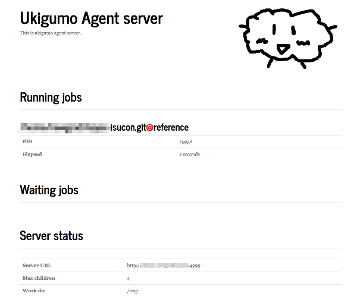
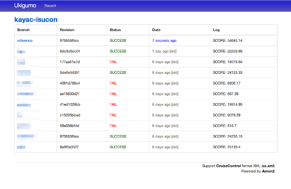
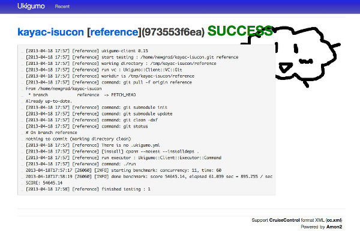

ISUCONベンチマーククライアント
==============================

## 用意するもの ##

* [改造版 http_load](http_load-12mar2006/)
* ベンチマーク実行ホストに [Ukigumo-Agent](https://github.com/ukigumo/Ukigumo-Agent) + [ukigumo-agent.patch](ukigumo-agent.patch) を動かす
* 結果表示ホストに [Ukigumo-Serer](https://github.com/ukigumo/Ukigumo-Agent) + [ukigumo-server.patch](ukigumo-server.patch) を動かす

## 実行例 ##

* ベンチマーク実行ホスト : bench.example.com
* 結果表示ホスト : admin.example.com
* 計測対象ホスト : sv00.example.com, sv01.example.com
* ユーザ名 : isucon

### 計測対象ホストに対応するconfigとbranchの用意 ###

ベンチマーク計測ホストでリポジトリを用意.

```
$ cd /home/isucon
$ git init --bare isucon.git
```

手元のマシンでconfigを作成し、gitリポジトリにしてbranchを切ってベンチマーク計測ホストにpush.

```perl
# config.pl
{
    reference => "sv00.example.com:5000",
    hogehoge  => "sv01.example.com:5000",
};
```

```
$ git init
$ git remote add bench isucon@bench.example.com:isucon.git
$ git checkout -b reference
$ git checkout -b hogehoge
$ git push bench reference
$ git push bench hogehoge
```

### 計測実行 ###

手元のマシンで branch=[計測対象ブランチ名] を指定して Ukigumo-Agent に POST する.

```
$ curl -d repository="/home/isucon/isucon.git" -d branch=reference http://bench.example.com:1984/api/v0/enqueue
```

* Ukigumo-Agent がベンチマークリポジトリをcheckoutし
* [`run`](run) が実行され、結果が Ukigumo-Server に通知される


### screenshot ###








